```{r setup, echo=F, message=F}
library(RMySQL)
library(dplyr)
library(krsp)
```

[Amazon Web Services](http://aws.amazon.com) (AWS) is a platform that offers a bewildering array of cloud computing services. Among their many products is the [Relational Database Service](https://aws.amazon.com/rds/) (RDS) which gives users the ability to quickly deploy virtual computers (called instances) to house databases in the cloud. The specifications (number of cores, RAM, and storage) of an instance can be tailored to the size of the database and number of users, and AWS charges an [hourly rate](https://aws.amazon.com/rds/pricing/) that depends on the computing power of the instance. 

The diversity and flexibility of AWS makes it extremely powerful; however, it also makes simple tasks daunting and confusing. This document will focus on a single, well-defined goal: setting up MySQL Server on an AWS RDS instance and migrating an existing database to the cloud. The only prerequisite is an AWS account, which you can [sign up for](http://aws.amazon.com) if you haven't already. A credit card is required to sign up, but you will only be charged for computing time you use, and Amazon offers an excellent [free tier](https://aws.amazon.com/free/) that is suitable for small databases.

# Deploying an RDS Instance

Log in to the [AWS Console](console.aws.amazon.com) and select the region appropriate for your location from the drop down on the top right.

## Creating a security group

AWS [security groups](http://docs.aws.amazon.com/AWSEC2/latest/UserGuide/using-network-security.html) act as virtual firewalls that control remote access to instances. They determine the range of IP addresses that can connect to an instance and what services (e.g. SSH or MySQL Server) will be available for that instance. An RDS instance should only provide access to MySQL Server.

To set this up, from the AWS Console, click on the EC2 icon under *Compute*.

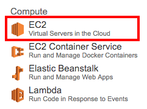

Then select *Security Group* from the left panel and click the *Create Security Group* button, give the new security group a name (e.g. `rds`), and add the rule: 

- Type: **MYSQL/Aurora**; Source: **Anywhere**

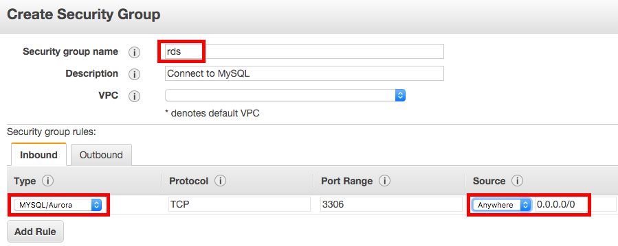

Note that I've opened this instance to connections from any IP address. If security was a major concern we could create rules with specific IP addresses for each user; however, this significantly increase the work required to configure and manage the database.

## Launching the instance

To launch an RDS instance, return to the main AWS Console and click on the RDS icon under *Database*.

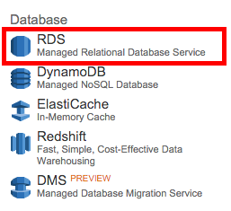

Next select *Instances* on the left panel, then click the *Launch DB Instance* button. You'll now proceed through 4 pages of settings for setting up the instance.

### Step 1: Select Engine

First you'll need to choose a database engine to work with. To launch a MySQL instance, click the MySQL tab, then click the *Select* button.

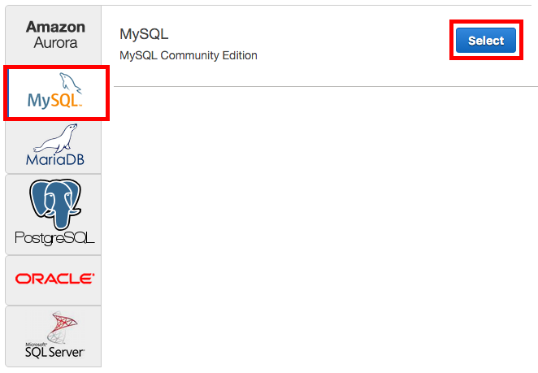

### Step 2: Production?

This step asks whether you want create a production or test database. Production databases have higher performance, but also higher cost. Since the KRSP database is small, with few users, a test database *should* meet the performance requirements. Therefore, I suggest initially using a test database and only switching to a production database if performance becomes an issue.

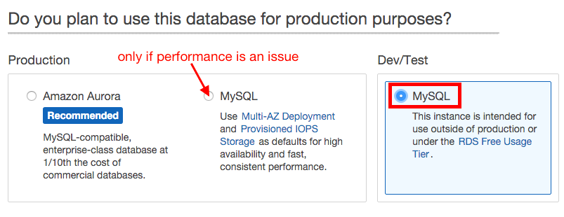

### Step 3: Specify DB Details

On this page you'll enter specific details for the RDS instance you're creating. In the *DB Engine Version* dropdown select the most current version of MySQL Server (5.7.10 at the moment). The *DB Instance Class* specifies the RAM and cores you want for the instance. The first choice in the dropdown (`db.t2.micro`) is the free tier and should be suitable for the KRSP database. Again, this can be changed to a more expensive tier if performance is an issue. Select *No* for *Multi-AZ Deployement*, and choose 5GB of storage.

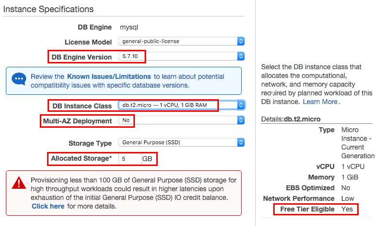

In the lower section of this page you should set the name of the instance to `krsp` and pick a username and password for the master user. This is the user that will have full permissions over the database and will create other users as needed. Therefore it's important to choose a secure password, and I suggest picking a generic username (e.g. `root`) rather than one specific to a person (e.g. `matt`).

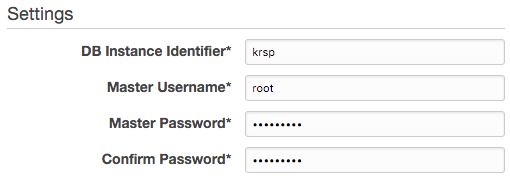

### Step 4: Configure Advanced Settings

Here you'll configure the advanced settings, most which can be left as the defaults. To enable remote access to the instance, you will need to set the *VPC Security Group* to the security group you created at the start of this tutorial. In the *Database Name* field enter `krsp` to instruct AWS to create a blank database with this name when the instance is created.

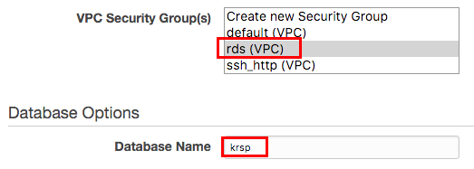

Finally, RDS will automatically backup the database according to a user-defined schedule. Since the KRSP database is mostly static, backups are of minimal importance. Set this field to 0 to disable backups or, to be a bit more careful, choose a large number such as 30 days.

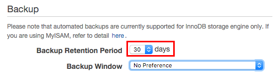

## Instance address

Now that you've created an instance you'll need the address so you can connect remotely. Return to the *RDS Dashboard* and click *Instances* in the left panel. Then click on instance you just created. *Endpoint* should be a URL ending in `rds.amazonaws.com`, this is the address that you'll use to connect to the remote MySQL database you've just created.

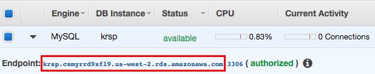

# Connecting to MySQL on AWS

Connecting to this cloud-based MySQL Server instance is almost identical to connecting to a local copy of MySQL. The cloud database can be accessed via a variety of tools and I outline the process for several options below.

## Navicat

Several users of the KRSP database use [Navicat](http://www.navicat.com/) as a GUI front end to the database. It is paid software, although there is a free trial. To create a connection to the cloud-based database, click the *Connection* button in the toolbar, select *MySQL*, and fill out the fields highlighted in the below image. Fill in the *User Name* and *Password* fields with your actual username and password. Also, you'll need to enter the correct *Host Name*, which is accessible via the *Instances* page of the *RDS Dashboard* on AWS, or by asking one of the database administrators for the project.

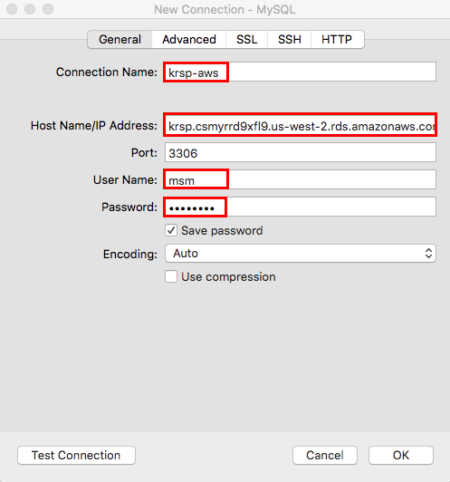

After you've entered all the necessary information click *OK*, then double click on the connection name (`krsp-aws`) to connect.

## MySQL Workbench

[MySQL Workbench](https://www.mysql.com/products/workbench/) is a free, cross-platform GUI interface to MySQL created by the MySQL Project. For those not wishing to pay for software, MySQL Workbench is a good alternative to Navicat. To create a connection to the cloud-based database, click the `+` symbol next to *MySQL Connections*, then fill out the dialog box as highlighted in the below image, making sure to user your actual *Username* and the correct *Hostname*.

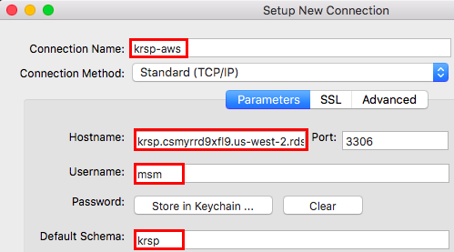

After you've entered all the necessary information click *Close*, then click on the connection name (`krsp-aws`) to connect.

## R

MySQL databases can be accessed in R using a variety of approaches: the `RMySQL` package, the `src_mysql` function in `dplyr`, or `krsp_connect` function in the custom `krsp` package. In all cases, you need to create a `my.cnf` connection file to store the location of the database and your credentials. This avoids having to store sensitive information, such as your password, within your R code.

On Mac OS and Linux the connection file is `~/.my.cnf` and on Windows it is located at `C:/my.cnf`. Note that this file must be plain text and have no ".txt" extension. Open this file, or create it if it doesn't already exist, and enter the following text:

```
[krsp-aws]
user=msm
password=F60RUsyiG579PeKdCH
host=krsp.abc123.us-west-2.rds.amazonaws.com
port=3306
database=krsp
```

Make sure you edit this to include your own username and password, and the correct host, which is the Public DNS of the AWS instance or the IP address of a remote computer. Mutliple connection profiles can be set up with different names, here I've used `krsp-aws` for the name of this profile.

To reduce the risk of someone getting access to your database credentials, it's wise to set the permissions of the `.my.cnf` file so only you can read it. In the terminal, navigate to the home directory and enter the following command:

```bash
sudo chmod 600 .my.cnf
```
Note that this doesn't apply to Windows.

To create a connection object with `RMySQL`, run the following code in R:

```{r rmysql, eval=F}
db <-  dbConnect(MySQL(), group = "krsp-aws")
```

To connect using `src_mysql`, note that supplying `NULL` to the three listing arguements is critical:

```{r src-mysql, eval=F}
db <- src_mysql(group = "krsp-aws", dbname = NULL, password = NULL, user = NULL)
```

 Finally, with `krsp_connect` there is no need to use `NULL` arguments.
 
```{r krsp-connect, eval=F}
db <- krsp_connect(group = "krsp-aws")
```

# Managing MySQL Users and Privileges

Managing users is a critical part of managing the KRSP database. New members of the project will need to be added as users and those leaving the project should be removed from the list of users, thus revoking their access. Both Navicat and MySQL Workbench offer graphical interfaces to managing users; however, I suggest using MySQL Workbench for user management.

I'll start by outlining creating users and adding privileges in general, then describe how to do this in MySQL Workbench. Finally, I'll suggest some best practices for managing users of the KRSP database.

## Users, hosts, and privileges

MySQL Server controls access through a list of users, each with a specified host (i.e. host name or IP address from which they are allowed to connect) and set of privileges (e.g. `SELECT` or `DELETE`). This system allows fine-grained control over where users can connect from, what tables they can connect to, and what they can do to those tables. By employing these tools correctly you can ensure that the database is secure and that no one unintentionally modifies the data.

### Hosts

The **host** typically specifies an IP address from which the given user is allowed to connect. For example, if a new user's campus IP address is `142.103.59.207`, I can create a profile for this user and assign this IP address as the host. The new user will now be able to connect to the database from campus. However, if that user goes home and tries to connect from this new location, with a different IP address, they will be denied access.

The percent character (`%`) acts as a wildcard when specifying IP addresses in MySQL Server. For example, using `142.103.59.%` would allow connections from any IP address beginning with `142.103.59`. This is useful for specifying a whole range of IP addresses such as all IPs for a given department on a university campus. To allow connections from any IP address, simply set the IP for the user to `%`.

### Privileges

Each user is given a set of **privileges** that specifies what actions they are allowed to take on the database. For example, some users may only be able to `SELECT` from tables, while others may be able to `MODIFY` or `DELETE`. These privileges can be granted on the level of tables, schemas, or the database as a whole

The [MySQL documentation](http://dev.mysql.com/doc/refman/5.7/en/grant.html) gives a full list of privileges, but the most common are:

- `SELECT` user can read data from tables
- `CREATE` user can create new tables
- `DROP` user can delete tables and databases
- `DELETE` user can delete rows from tables
- `INSERT` user can add new rows to tables
- `CREATE USER` user can create new users
- `GRANT OPTION` user can grant privileges to other users

## MySQL Workbench

MySQL Workbench provides an intuitive GUI for managing users and privileges To manage users, connect to MySQL on AWS as a user with administrative privileges. If you haven't created any administrators yet, log on using the master user you specified when launching the RDS instance (I suggested calling this user `root` above).

In the left sidebar, under *MANAGEMENT* click on *Users and Privileges*. You should see a list of users and corresponding hosts. By clicking on a user you can explore and change the settings for that user.

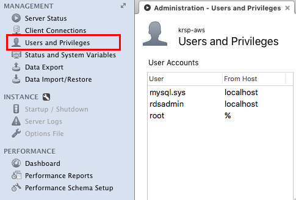

To create a new user click the *Add Account* button, then enter a sensible username and password. In the *Limit to Hosts Matching* field you should enter either `%`, to allow access from any IP, or the IP address of the user to restrict access. Googling "ip address" from the location the user intends to connect from is an easy way to find out the IP address for that location.

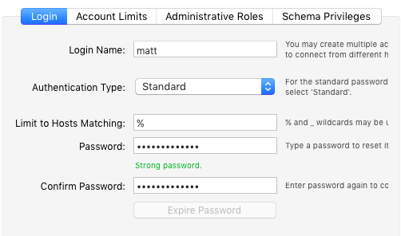

Click the *Apply* button to create this user. If you want to force this new user to immediately change their password when they first connect (often a good idea), click the *Expire Password* button; however, note that this may not work with older versions of MySQL. This creates the user, but doesn't give them the ability to do anything. You should now edit the *Schema Privileges* and possibly *Administrative Roles* tabs to set privileges for this new user.

### Schema privileges

This tab allows privileges to be set for specific tables or schemas. In general, users of the KRSP database will only need access to tables in the `krsp` schema. Click the *Add Entry...* button, select *Selected schema*, choose `krsp` from the dropdown, and click *OK*.

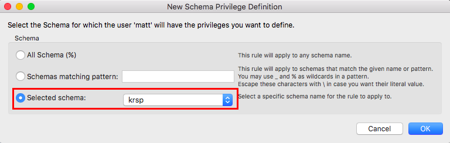

Now select all the check boxes corresponding to the privileges this user should have. The majority of users will only need to access data and will have no need to modify the database. In these cases, it's best to only give `SELECT` privileges to these users, which prevents them from changing the database accidentally or intentionally.

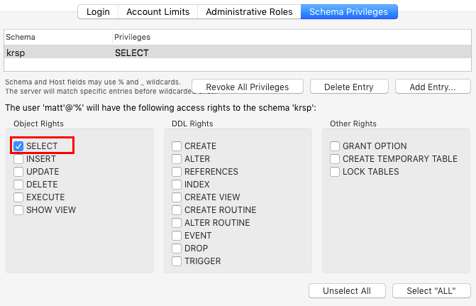

Database administrators will need to modify and update the database. So, for these users, click the *Select "ALL"* button to give them full privileges. Once privileges have been set, click *Apply*.

### Administrator roles

This tab controls the administrative privileges of the user, including the ability to manage other users. Privileges applied here apply to *all* schemas and tables in the database. For the majority of database users, all the boxes on this tab should be left unchecked. However, to create an administrative user that will manage other users, you should check the boxes next to `SecurityAdmin` in the left panel, then check the box next to `SELECT` in the right panel.

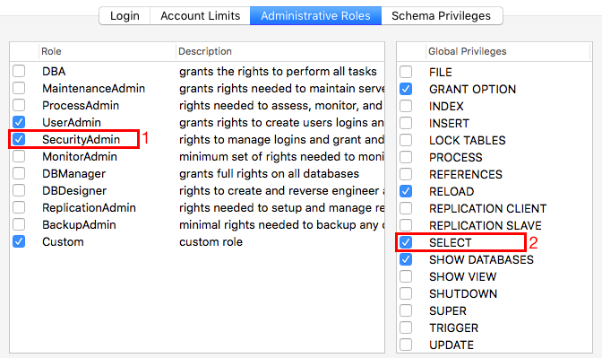

Click the *Apply* button when you're done on this tab.

### Revoking privileges

If a user has left the project and no longer needs access to the database, select them from the user list and click the *Delete* button. If you want to keep a user, but revoke all their privileges, select them from the user list, go to the *Administrative Roles* tab, and click the *Revoke All Privileges* button. You can now redefine their privileges as necessary.

## Best practices for the KRSP database

Working under the assumption that the KRSP database does not contain highly sensitive data and that access should almost always be read only, I suggest having two classes of users: normal, read-only users and administrators. The following best practices should be adhered to for each type of user.

### Normal users

Most normal database users will only need to read data in tables to perform analyses. The following best practices apply:

1. Each user of the database should have their own username and password; no sharing of login credentials. Where possible, use the person's 2-3 letter observer code (in lowercase) as their username (e.g. `abc`).
2. Normal users should only be granted `SELECT` privileges on the `krsp` schema and, for simplicity, should be allowed access via any host (i.e. `%`).
3. Accounts should be created with a temporary password that will be set to immediately expire by clicking the *Expire Password* button. The new user should be instructed to login as soon as possible and will be forced to change their password when they do. This initial login to change the password must be done in MySQL Workbench or via the command line.
4. As people leave the project,t their access should be revoked and their account deleted as soon as possible. Leaving extra users floating around is a security risk!

### Administrators

In addition to these read only users, the KRSP database will require some administrators who can manage other users and make changes to the data, for example to add new data at the end of a field season. This should be a very small subset of people. The following best practices apply:

1. Each admin user should have their own username and password. Where possible, use the person's 2-3 letter observer code (in lowercase), followed by `-admin` as their username (e.g. `abc-admin`).
2. For security reasons, administrators should only be able to connect via a specified IP address. They should use the IP for the location they typically access the database.
3. Administrators should also have a normal, read-only account, which they should use for normal data analysis. For example, the user with observer code `abc` could have two usernames: `abc`, with select only privileges, and `abc-admin` with full admin privileges. They would only use `abc-admin` when conducting database or user maintenance. To separate the two accounts, use MySQL Workbench for `abc-admin` and Navicat for `abc`.
4. As described above, to set up an administrator's privileges go to the *Administrative Roles* tab and select `SecurityAdmin` in the left panel followed by `SELECT` in the right panel. Then, in the *Schema Privileges* tab grant all privileges on the `krsp` schema.
5. Only use the `root` user (i.e. the one created when launching the RDS instance) to set up the initial set of administrative users, then use these administrative users to perform all future user or data management.

# Migrating the Database

Now that we have MySQL running in the cloud on AWS, it's time to populate it with some data. In particular I'll describe how to migrate a local instance of the KRSP database to the cloud. There are a variety of ways to do this, but I'll focus on using MySQL Workbench since it's a free, cross-platform solution that doesn't require the command line.

## Export

Open up MySQL Workbench and connect to the local KRSP database. In the left pane, under *MANAGEMENT*, click *Data Export* and select the check box next to the `krsp` scheme. Then click *Unselect All* and select the check boxes next to the tables you want to migrate. If you want to migrate all the tables click *Select Tables*; however, this will include all the old DB2 tables, which may be undesirable. One **important note** is that you must not select any views if they exist since AWS doesn't allow migrating views in this way.

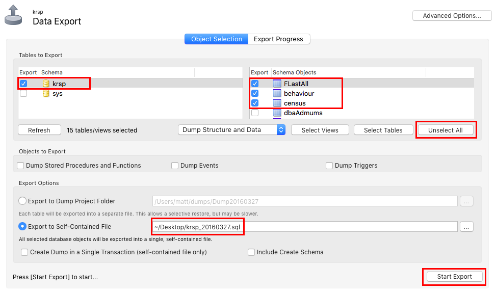

Chose to *Export to Self-Contained File* and pick a sensible file name and location. Click *Start Export* and MySQL Workbench will output a .sql file to the location you specified.

## Import

Now close the connection to the local KRSP database and open a connection to the AWS database we created earlier; you'll need to log in as an administrator. In the left pane, under *MANAGEMENT*, click *Data Import*, select *Import from Self-Contained File* and pick the file you just exported. Click *Start Import* and wait for all the data to copy over.

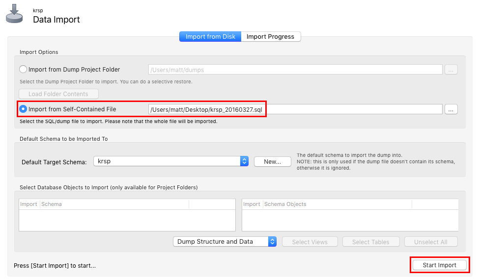

At this point, you'll want to check to ensure that all the tables have been copied over as expected.
